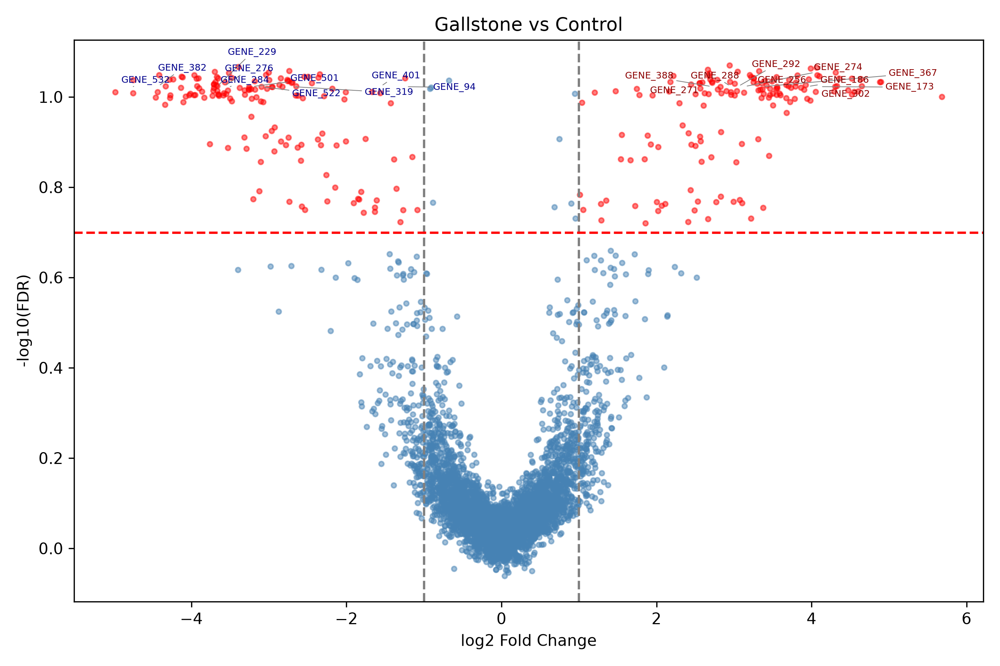
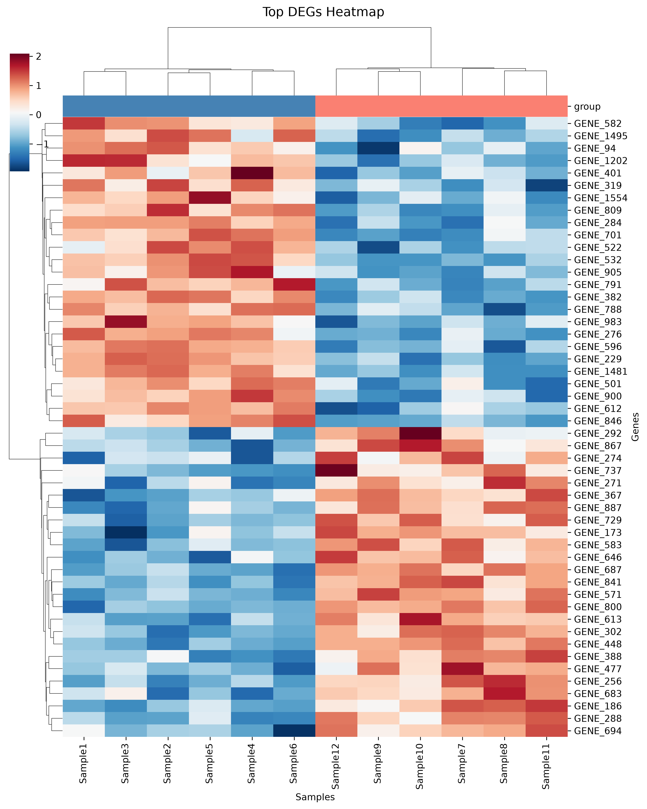

# Gallstone Transcriptomic Explorer


## Overview

Gallstone Transcriptomic Explorer is a Python-based bioinformatics tool designed to automate transcriptomic analysis workflows for gallbladder and gallstone-related RNA sequencing datasets.

The tool simplifies repetitive analysis steps commonly performed during differential gene expression and pathway analysis, and is tailored for comparing gallstone vs. control gallbladder tissue samples.

## Example Output

**Volcano Plot** — significant DEGs highlighted in red:



**Heatmap** — top 50 DEGs clustered by expression pattern:



## Motivation

Transcriptomic analysis pipelines often require repetitive manual processing steps, including metadata organization, differential expression analysis, visualization, and preparation of ranked gene lists for downstream enrichment analyses.

This project streamlines these workflows into a reproducible and modular Python-based framework tailored for gallbladder and gallstone-related datasets, supporting exploratory biomedical research.

## Quick Start

```bash
git clone <repository-url>
cd Gallstone-Transcriptomic-Explorer
pip install -r requirements.txt
python src/main.py
```

## Features

- Interactive command-line interface — run with example data or your own
- Load RNA-seq expression matrices and clinical metadata
- Differential expression analysis (Wilcoxon rank-sum test + Benjamini-Hochberg FDR correction)
- Volcano plot with labeled top DEGs
- Heatmap of top differentially expressed genes
- Automated analysis summary report
- 12 automated tests with pytest

## Pipeline

```
Expression Matrix + Metadata
        ↓
Differential Expression (Wilcoxon + BH FDR)
        ↓
  ┌─────────────────────┐
  │  Volcano Plot        │
  │  Heatmap            │
  │  Report             │
  └─────────────────────┘
        ↓
    results/
```

## Input

The tool expects two CSV files:

**Expression matrix** — genes as rows, samples as columns:

| Gene | Sample1 | Sample2 |
|------|---------|---------|
| SOX9 | 5.1 | 2.3 |
| COL1A1 | 8.3 | 1.2 |

**Metadata CSV** — one row per sample with group annotation and optional clinical fields:

| sample | group | sex | age | bmi | diabetes | statin_use |
|--------|-------|-----|-----|-----|----------|------------|
| Sample1 | Control | F | 54 | 27.1 | no | yes |
| Sample2 | Gallstone | M | 63 | 31.4 | yes | no |

> **Important:** the `group` column must contain exactly two values: `Control` and `Gallstone` (capital C and G).

Optional metadata fields may include: sex, age, BMI, smoking status, diabetes, hypertension, medication usage, histological phenotype, and batch information.

## Output

All outputs are saved automatically to the `results/` directory:

- `differential_expression.csv` — full DEG table with log2FC, p-value, and FDR
- `volcano.png` — volcano plot with top DEGs labeled
- `heatmap.png` — clustered heatmap of top 50 DEGs
- `report.txt` — analysis summary with DEG counts and top gene lists

## Installation

Clone the repository:
```bash
git clone <repository-url>
cd Gallstone-Transcriptomic-Explorer
```

Create and activate a virtual environment:
```bash
python3 -m venv .venv
source .venv/bin/activate
```

Install dependencies:
```bash
pip install -r requirements.txt
```

## Requirements

- Python 3.10+
- pandas
- numpy
- matplotlib
- seaborn
- scipy
- statsmodels
- adjustText

## Usage

Run from the project root:
```bash
python src/main.py
```

You will be prompted to choose:
```
==================================================
  Gallstone Transcriptomic Explorer
==================================================

Would you like to:
  1. Run with example data
  2. Use your own data

Enter choice (1 or 2):
```

If you choose option 2, you will be asked to provide paths to your expression matrix and metadata CSV files.

## Example Data

To regenerate the example dataset (simulated data with spiked-in DEGs):
```bash
python generate_example_data.py
```

This creates `examples/expression_matrix.csv` and `examples/metadata.csv`.

## Running Tests

```bash
python -m pytest tests/ -v
```

All 12 tests should pass.

## Project Structure

```
Gallstone-Transcriptomic-Explorer/
├── src/
│   ├── main.py                      # interactive entry point
│   ├── data_loader.py               # loads expression matrix and metadata
│   ├── differential_expression.py   # Wilcoxon rank-sum + BH FDR correction
│   ├── visualization.py             # volcano plot and heatmap
│   └── report_generator.py          # automated text summary
├── examples/
│   ├── expression_matrix.csv        # simulated example data
│   └── metadata.csv                 # example sample annotations
├── docs/
│   ├── volcano.png                  # example volcano plot
│   └── heatmap.png                  # example heatmap
├── results/                         # outputs saved here
├── tests/
│   └── test_pipeline.py             # 12 pytest tests
├── generate_example_data.py         # script to regenerate example data
└── requirements.txt
```

## Future Improvements

- GSEA integration for pathway enrichment analysis
- Interactive dashboard (Streamlit)
- Batch effect correction utilities
- Automated pathway enrichment analysis
- Support for additional metadata-based subgroup comparisons

## Course Information

This project was developed as part of the [Python programming course](https://github.com/Code-Maven/wis-python-course-2026-03) at the Weizmann Institute of Science.
